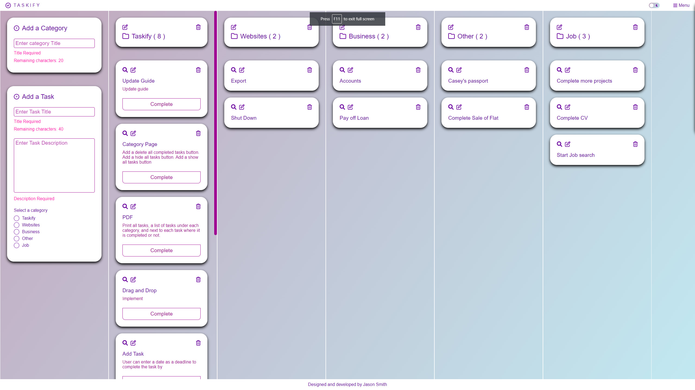
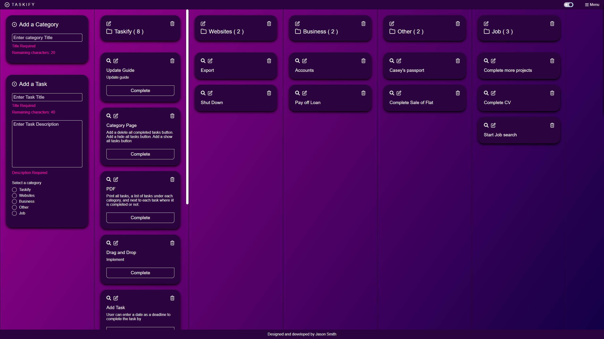

# Taskify - Tasklist application

👋 Hi, I’m @Jason-Smith-Code

👀 I’m interested in

-   Programming (Javascript)
-   Gaming ( RTS, FPS & ARPG's)

📫 How to reach me
https://www.linkedin.com/in/jason-smith-code/

## Application Description

Taskify is a task list react web application which allows users to fill in a short form to display their tasks.
A user starts off by creating a category to organise and group their tasks.
After creating a category the user can then start adding their tasks, each task can then be marked as complete, editted or deleted.

## Objective

Taskify will be a mobile responsive application, it will have a beautiful modern and minimalistic user interface and allow the user to switch between light and dark mode.
Taskify will allow users to create, delete, and edit categories as well as create, delete, edit and complete tasks.
An off screen menu will be available to allow users to navigate the application.
Each category will have its own page where the user can view a simplified interface of tasks in that category.
The default page of Taskify will be an overview of all categories and tasks.
There will be a guide page to illustrate how to use the application.
I will get feedback on my application and make adjustments if needed.
I aim to create this application in 30 days working part time.

## How to navigate this project

-   Handling dynamic user generated links [CategoryTemplate](https://github.com/Jason-Smith-Code/taskify/blob/main/src/routes/CategoryTemplate.js)
-   Building the menu [Menu](https://github.com/Jason-Smith-Code/taskify/blob/main/src/components/menu/Menu.js)

## What was my Workflow

-   **[x] Research todo apps**  
    Researched mobile & desktop apps which handle task lists, take notes of the layout and features.

-   **[x] Write up the idea of the project**  
    Made a list of features i wanted to include in my application from the research. I created a priority list, marked the most important tasks, and the rest were bonus objectives if I had enough time.

-   **[x] Brain storm Project Title**  
    Made a list of all words associated with the project subject, experimented with combining those words together, forming a final list potential titles. Gathered opinons about that list and picked the most popular one.

-   **[x] Decide on colour palette for the theme**  
    [My Colour Theme](https://coolors.co/69009e-9e0091-ff00b1-c2a5bc-c1e9f1). Coolors.co is a fantastic App to choose colours for a theme, testing combinations and contrast decided to go with purple hues and picked some cold and warm variations to separate foreground and background.

-   **[x] Create a wireframe of Taskify**  
    Used wireframing tool [FIGMA](https://www.figma.com/) to plan out my application.
    You can see the results of that work [here](DOWNLOAD LINK TO PDF PLAN)

-   **[x] Use github for version control**  
    Set up repository on github, and access it locally to start work. Using git commands to regularly push commits to the repository.

-   **[x] Install packages**  
    I had an idea what packages I was going to work with based on the features I wanted to include. Working with React, Jest for testing, redux toolkit for state management, react router and any additional libraries were installed later in the project.

-   **[x] Setup file structure**  
    For this project I used create-react-app, I re-organised the file structure and began adding javascript files.

-   **[x] Implement Layout and theme**  
    Working from the wireframe I began to build the layout of the application then apply the colour theme.

-   **[x] Implement state management (Redux toolkit)**  
    I love redux, and prefer to use redux toolkit, which simplifies the process making it easy to scale an App, allow easy access of state to any file.

-   **[x] Implement forms for adding tasks and categories** 
    Using redux, I created the 2 main forms which acted as the core functionality of this App, allowing the user to build their own user interface of tasks and categories.

-   **[x] Implement forms for editting tasks and categories**  
    Realising users could make mistakes when adding a task or category, I had to have some functionality in place to allow the user to make changes.

-   **[x] Implement all task and category features**  
    Creating, editing, deleting categores. Creating, viewing, editing, deleting and completing tasks. These are the core features of this application.

-   **[x] Implement React Router**  
    The main interface became cluttered when full of categories and tasks, which also made the mobile view to much of a scrolling hike. To solve this I created category pages usign react router, this allowed me to have a simplified interface where the user could observe tasks from a specific category, reducing the amount of content on screen.

-   **[x] Build the menu**  
    I built an off screen menu which will contain links to the main overview, guide, and a dynamic list of categories. It will also be a place to acommodate functions for clearing data.

-   **[x] Create template for category pages**  
    Since the user is generating the content, they were also generating the name of url for each category title, I had to eliminate spaces in the title string, replaced them with "-".

-   **[x] Add a Light / Dark mode**  
    Realising that the theme may not cater for everyone's taste, I chose to add a dark version which also maintained the colour scheme of the app.

-   **[x] Create guide page**  
    I wanted to explain the process of each feature so that users could have a reference point if they were unsure. The guide is located in the menu, it contains a description of each feature accompanied by an image, and an icon explanation.

-   **[x] Implement persisting data**  
    I chose to work wth local storage, but feel that having a user login, and saving the data to a user account would be a better solution, so that the user could access their tasks on another device. This would require having a server, to store user data on which is why I went wth local storage. I added user storage as a bonus objective to complete at a later date.

-   **[x] Implement a "clear data" button**  
    Allows users to have a fresh start by wiping

-   **[x] Test application**  
    I used React testing library with Jest, it's my first time using these both to fully test an application, I chose to do all my testing in one go as I felt that a longer duration of testing would help me get a better understandng of how it works.
    The objective was to test the application from the perspective of how a user would interact, and what they would expect to see.

-   **[x] Add Mobile, tablet and desktopp optimisation**  
    I want the application to look great on screens, I used a mobile first css approach.

-   **[x] Create a build and deploy to github pages**  
    To showcase this application, I will use github pages as its free and easy to setup.

## Why I built the project this way

## Screen Shots

Main Page : Light Theme

Main Page : Dark Theme

## Viewing the application

Visit : https://jason-smith-code.github.io/taskify/

## Project status

Currently the project is at version 1.1.0
It has the base features I planned on including, I plan on introducing more features at a later date, you can see those additional features below.

## Bonus Objectives

Version 1.2.0
[ ] Assigning a date to complete by on each task
[ ] Add animations
[ ] Print current tasks by converting them into a downloadable PDF

version 1.3.0
[ ] allow user to register
[ ] allow user to login
[ ] allow user to logout
[ ] saving the state to a user

version 1.4.0
[ ] Create video tutorial
